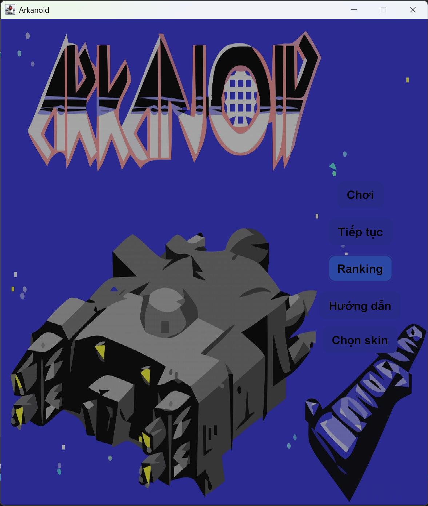
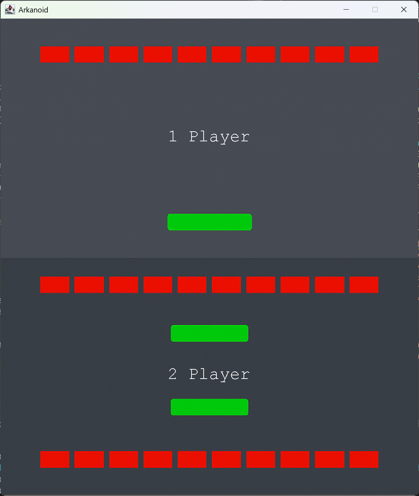
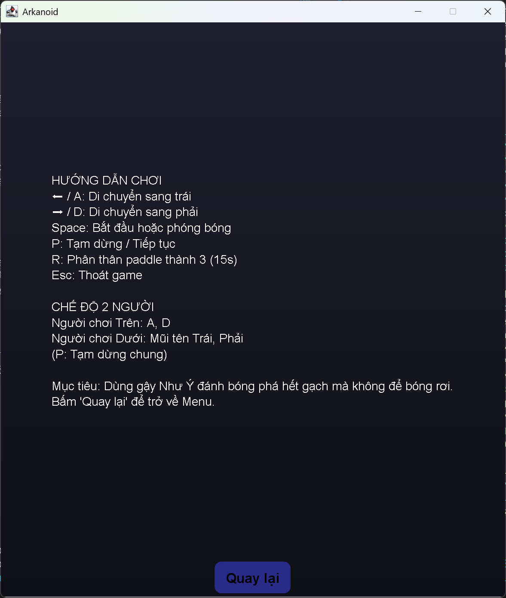
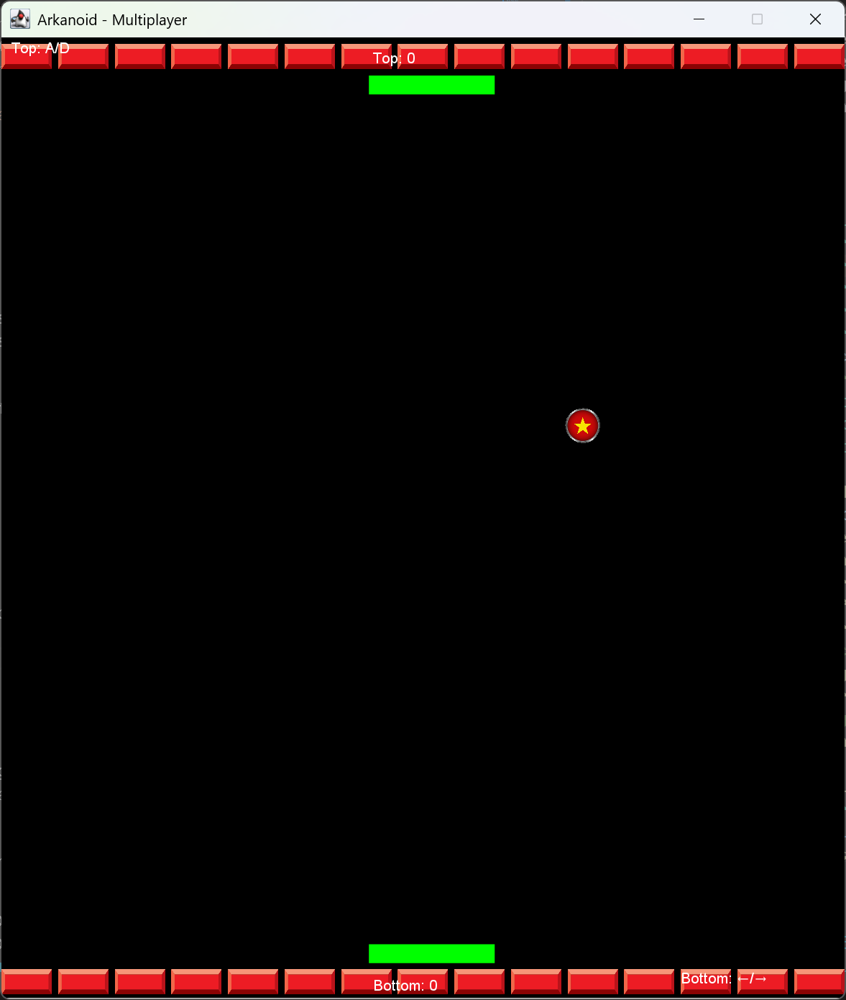
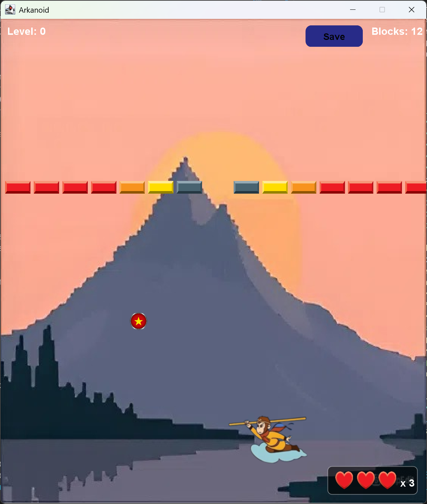
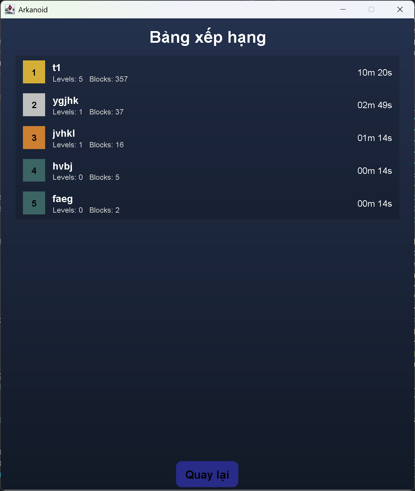

# Arkanoid (Java)

> Một bản Arkanoid nhẹ, dễ mở rộng, viết bằng Java (JDK 21), có âm thanh, power‑ups, chọn skin và cả chế độ 2 người chơi.

## 🎮 Tóm tắt

Arkanoid là game đập gạch cổ điển: điều khiển paddle để đánh bóng, phá vỡ mọi block trên màn hình. Dự án này tập trung vào gameplay mượt, cấu trúc rõ ràng, dễ tùy biến level, skin và cơ chế vật lý (phản xạ, góc bắn từ paddle, độ cứng gạch...).

## ✨ Tính năng nổi bật

- Game loop mượt với renderer tùy chỉnh (Swing)
- 7+ màn chơi mẫu và hệ nền (backgrounds)
- Skin cho paddle và bóng (tùy chỉnh kích thước hiển thị theo skin)
- Power‑ups: mở rộng/thu nhỏ paddle, bóng to/nhỏ, tăng tốc paddle, làm chậm bóng...
- Lưu điểm và xếp hạng (`saves/ranking.csv`), auto‑save tiến trình
- Âm thanh nền và hiệu ứng (nhạc, va chạm paddle/brick)
- Chế độ 1 người chơi và 2 người (trên/dưới)

## ⌨️ Điều khiển

- ← / A: Di chuyển paddle sang trái
- → / D: Di chuyển paddle sang phải
- Space: Bắt đầu game hoặc phóng bóng nếu đang gắn vào paddle
- P: Tạm dừng / Tiếp tục
- Esc: Thoát game (có hộp thoại xác nhận)

### Chế độ 2 người
- Người chơi Trên: A, D để di chuyển
- Người chơi Dưới: Mũi tên Trái, Phải để di chuyển
- P: Tạm dừng chung cho cả hai

Mục tiêu: giữ bóng không rơi khỏi màn hình và phá hết các khối gạch.

## 🗂️ Cấu trúc dự án

- `src/` – mã nguồn Java
  - `entities/` – đối tượng game: `Ball`, `Paddle`, `Block`, quản lý skin
  - `game/` – điều khiển game: `GameLoop`, `GamePanel`, `Renderer`, `CollisionManager`, v.v.
  - `levels/` – định nghĩa level, nền và `LevelManager`
  - `powerup/` – định nghĩa `PowerUp` và `PowerUpManager`
  - `ui/` – giao diện: menu, bảng xếp hạng, chọn save, button style
  - `utils/` – tiện ích: `GameConfig`, `AudioManager`, `Velocity`, `MusicPlayer`
- `images/` – tài nguyên hình ảnh (paddle/ball skin, bricks...)
- `music/` – âm thanh và nhạc nền
- `saves/` – cấu hình nhỏ (`*.cfg`) và xếp hạng (`ranking.csv`)

## 🧪 Cơ chế gameplay (tóm tắt)

- Vật lý đơn giản dạng 2D: bóng di chuyển theo vector `Velocity(dx, dy)`; phản xạ bằng cách đảo dấu `dx`/`dy`.
- Góc bắn từ paddle dựa theo vị trí chạm (hit offset) ⇒ người chơi có thể “điều hướng” bóng.
- Gạch có độ cứng (1–3) và loại không thể phá; bóng to sẽ phá/làm yếu gạch nhanh hơn.
- Tránh kẹt va chạm bằng “cooldown” trong `CollisionManager` và reposition ±1px sau phản xạ.

## ⚙️ Tùy chỉnh nhanh

- `utils/GameConfig.java`: chỉnh kích thước màn hình, tốc độ bóng/paddle, kích thước block/ball, góc tối đa khi bật từ paddle, v.v.
- `levels/`: thêm/sửa level mới theo format có sẵn.
- `images/`, `music/`: thay skin/âm thanh. Lưu ý tên/đường dẫn ảnh/âm thanh phải khớp.

## 🧩 Lưu & Xếp hạng

- Điểm cao được lưu trong `saves/ranking.csv`.
- Một số tùy chọn nhỏ lưu ở `saves/*.cfg`.

